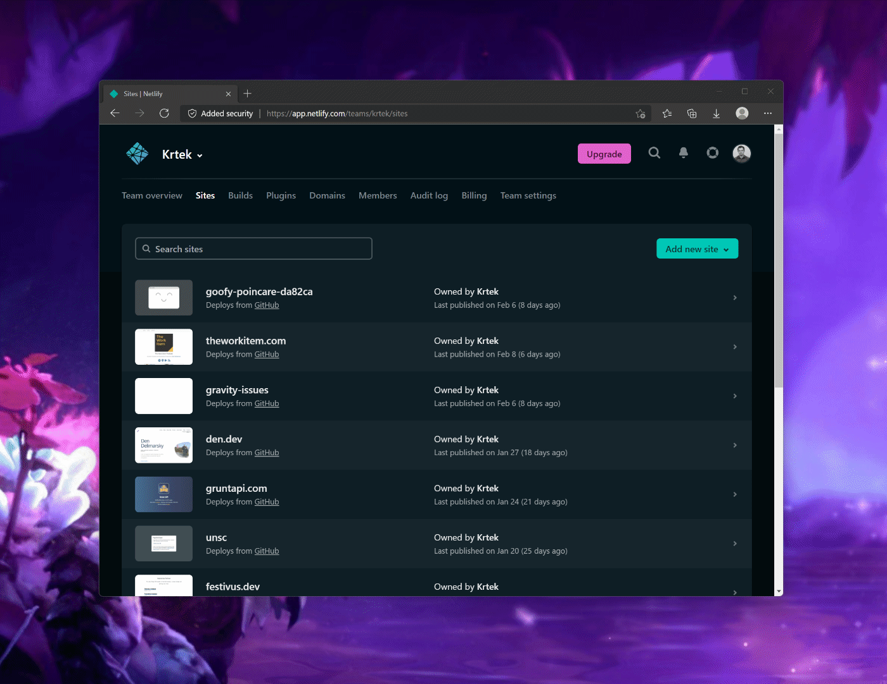
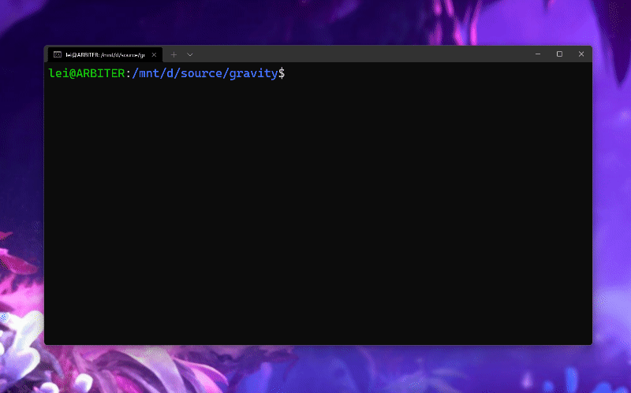
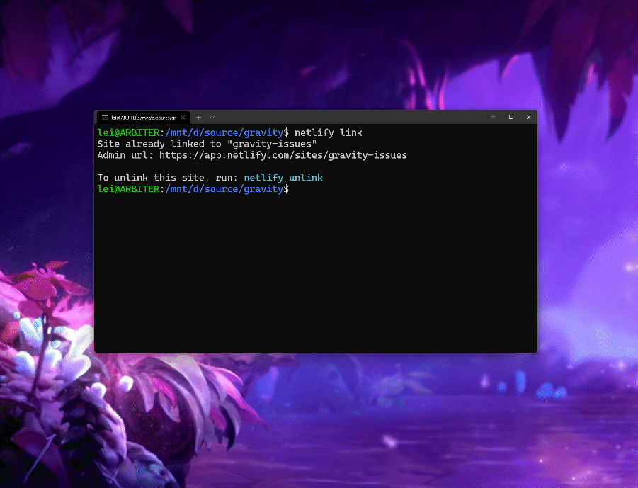

# ⭐ gravity

A web application designed to visualize cross-referenced issues in a GitHub repository.

It leverages [Netlify Graph](http://ntl.fyi/netlify-graph-docs) to authenticate against GitHub, and then execute one of stored GraphQL queries.

## Running

To get the application running, you will need to deploy it to Netlify and ensure that you have connected GitHub with Netlify Graph in your website.

## Editing Queries

To edit the pre-programmed GraphQL queries:

1. Install the Netlify CLI: `npm install netlify-cli -g`
2. Open the repository folder in your Terminal: `cd <repo_path>`
3. Ensure that the repository is linked to your site on Netlify: `netlify link`
4. Run: `netlify graph:edit`

When you link a repository to Netlify, you ensure that there is a direct connection between the changes you are making and the site hosted on the Netlify infrastructure.

Editing the graph with `netlify graph:edit` will allow you to customize the queries aand include any additional information or services that might be needed for your application.

